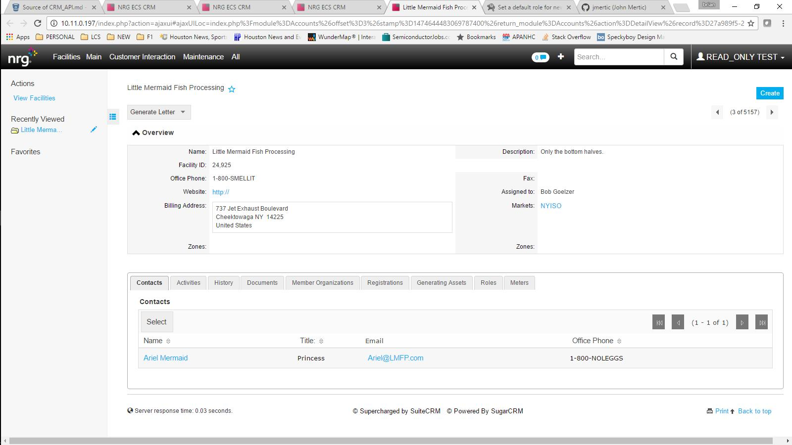

### Welcome to Tabbed Subpanels

This is an alternative to the "tabbed subpanel" solution embedded in SuiteCRM / SugarCRM CE.  Instead of generateing a tab for each "module menu filter" like the embedded solution this code uses jquery to post process the non-tabbed subpanels and create a version where each subpanel is its own tab.

### Authors and Contributors
Brian Lasher

### Installation
I apologize, however due issues caused by discrepencies between the zip file that GitHub creates and what is required for installation, there is a small process that needs to be completed for installation.  I'm not the only one with this issue as you can see an article about this in the sugar community forums at: https://community.sugarcrm.com/thread/23464.  The process is detailed below.

 1. Download zip file by clicking the "Download .zip" button at the top of this page.</li>
 2. Uncompress the zip</li>
 3. You will notice that there is a directory wrapped around the files.</li>
 4. Go into that directory and create a new zip file with those files.  If you were to unzip this new file, there should be a manifest file in the root dir.  If it is not there, you will not be able to install.</li>
 5. Take that new zip file and upload it to your CRM instance via the module loader</li>

### Usage

### Support or Contact</h3>

Having trouble? Contact me at <a href="mailto:me@brianlasher.com">me@brianlasher.com</a> and i will do my best to help you sort it out.
